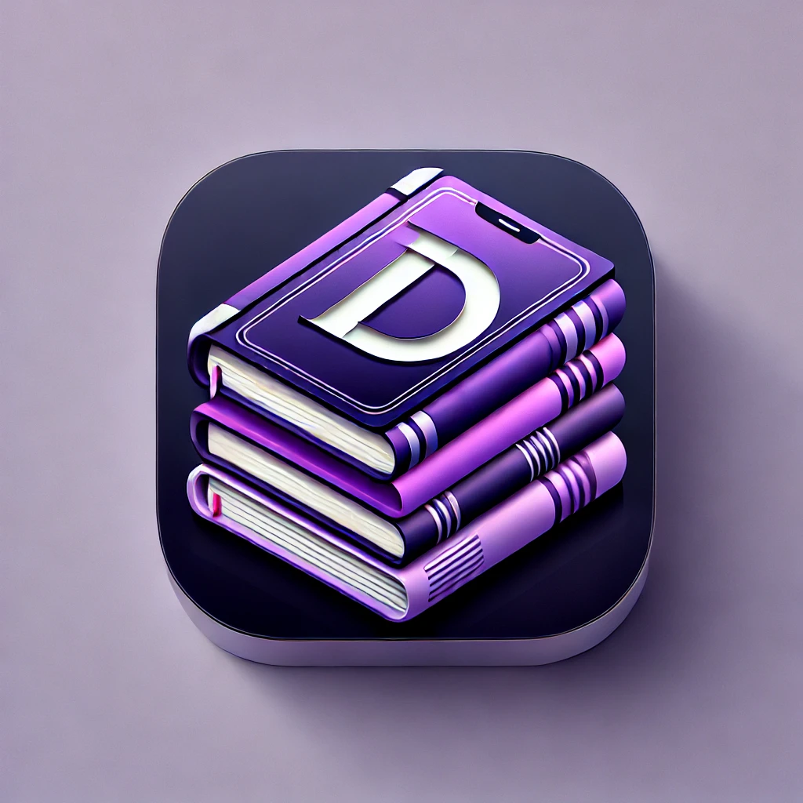
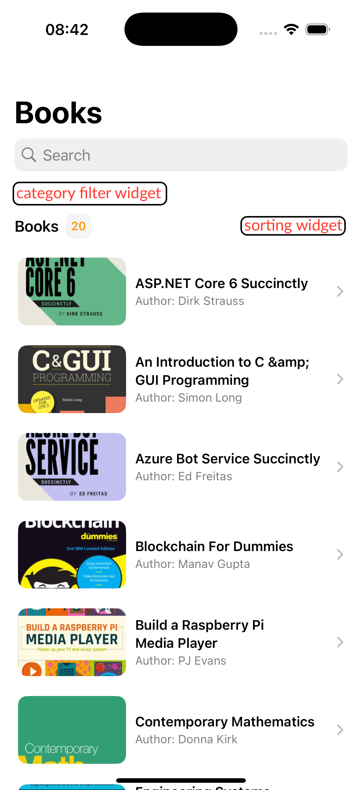
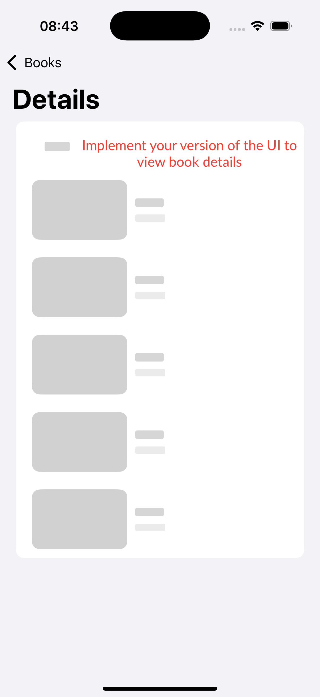

# iOS Developer Take-Home Test Assignment: Book Browser App 📚

  

## Overview  
This take-home test is designed to showcase your expertise in iOS development, your ability to create a great user experience, and your problem-solving skills.  
Your task is to develop a native iOS app that allows users to browse and explore books using the following API:  
[https://www.dbooks.org/api/](https://www.dbooks.org/api/)  
This project contains bootstrap code.

  
  

---

## Objective  
The goal of this project is to demonstrate:  
1. **iOS Development Skills**: Your proficiency with native iOS frameworks, Swift, and development best practices.  
2. **UI/UX Expertise**: Your ability to design and implement an intuitive, and responsive user interface.  
3. **Problem-Solving and Creativity**: Your approach to solving non-trivial problems and incorporating solutions. 

---

## Requirements  

### Functional Requirements  
1. **Browse Books**: Users should be able to view a list of books retrieved from the API.  
2. **Book Details**: Users should be able to tap on a book to view its details, including title, author, description, and cover image.  
3. **Search**: Implement a feature that allows users to search for books by title or author.  
4. **Filtering, Sorting, and Categorizing**: Add functionality to filter and sort books (e.g., by subject, title, author, or other criteria).  
5. **Offline Mode**: Implement caching to display previously loaded books when the network is unavailable.  

### Technical Requirements  
1. **Native iOS**: Use the provided template app as a starting point and develop new features. Your project must be written in **Swift** and primarily use **SwiftUI** (bonus: integrate a small **UIKit** widget). Ensure compatibility with the latest version of Xcode.  
2. **Architecture**: Follow a modern architecture pattern such as **MVVM**.  
3. **Persistence**: Use Core Data, UserDefaults, or a persistence library to implement book caching.  
4. **Concurrency**: Use **Swift Concurrency** (async/await) for asynchronous operations.  

---

### Bonus Requirements (Nice to Have):  
1. **Unit Testing**: Write unit tests to validate your logic and ensure code reliability.  
2. **Dependency Injection (DI)**: Implement dependency injection or a service locator pattern to decouple your code.  
3. **UI/UX Enhancements**: Make the app visually appealing, add animations, and refine the user experience.  

---

## HOWTO  
1. **Fork** this repository to your GitHub account.  
2. **Complete the tasks** described above.  
3. **Submit your work** by sending us a link to your repository with the completed project.  
   - If your repository is private, please add our account as a collaborator.  

---

Good luck, and we look forward to reviewing your project! 🚀
